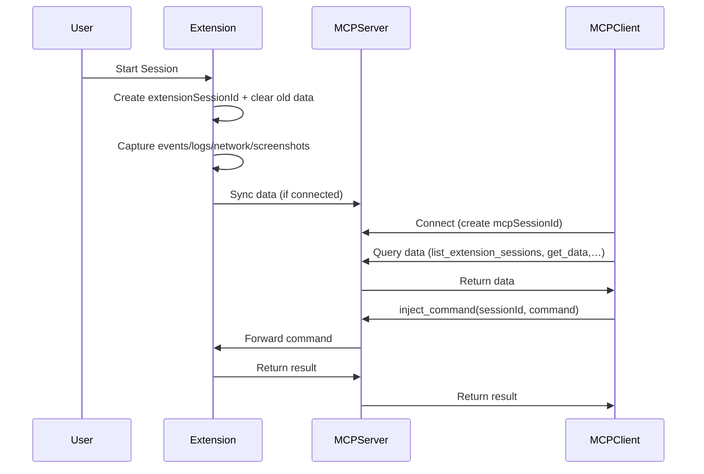

# SOFTWARE SPECIFICATION: CHROME EXTENSION + MCP SERVER

## 1. Overview
The system consists of 2 main components:
- **Chrome Extension**
    - Runs independently on Chrome, works without needing to connect to `MCP Server`.
    - Manages sessions by domain, data is stored locally (`IndexedDB`).
    - Supports exporting `JSON`.
    - When connected to `MCP Server`, data will be synchronized (sync) to the server.
- **MCP Server**
    - Receives data from the extension and stores it.
    - Provides `MCP protocol` interface for `MCP Clients` (Claude, GPT, Cursor, VSCode Copilot...) to connect.
    - Manages separate sessions for each MCP client (this session is independent, not related to the extension's session).
    - `MCP Clients` can query stored data from the extension or send control commands to the extension.

## 2. Chrome Extension

### 2.1 Session Management
- When the user clicks `Start` → creates a new session for the current domain.
- Each session is attached to only 1 domain (not shared).
- When starting a new session → clears old data.
- Stores session metadata in `IndexedDB`:
    - `sessionId` (UUID generated by the extension)
    - `domain`
    - `createdAt`
    - `lastUpdate`

### 2.2 Data Capture
- **Events**: Click, input, navigation.
- **Console logs**: `log`, `error`, `warn`, `info`.
- **Network traffic**: XHR, fetch, WebSocket.
- **Screenshot**: `base64` string.

### 2.3 Storage
- Data is stored in local `IndexedDB` for the current session.
- Exports data to `JSON` file.
- Screenshots are stored as `base64` (or `blob`).

### 2.4 Sync with MCP Server
- When connected to `MCP Server`:
    - Still stores locally (`IndexedDB`).
    - Synchronizes data to `MCP Server`.
- Has a `Sync` button to push unsent data.
- If connection is lost, the extension still runs normally.

### 2.5 UI (Markdown Mockup)
```
[ Extension Popup UI ]

------------------------------------------------
| [ Start Session ]   [ Stop Session ]          |
| Domain: current.domain.com                    |
| Session: #abcd-1234                           |
|                                               |
| Status: ● Connected to MCP Server             |
| (or ● Disconnected)                           |
------------------------------------------------
| [ Capture Console ] [✓]                       |
| [ Capture Network ] [✓]                       |
| [ Capture Events ]  [✓]                       |
| [ Capture Screenshot ] [ ]                    |
------------------------------------------------
| [ Export JSON ]   [ Sync Now ]                |
------------------------------------------------
```

## 3. MCP Server

### 3.1 Session Management
- When `MCP Client` (Claude, GPT, Cursor...) connects → server creates a separate `MCP Session`:
    - `mcpSessionId` (UUID generated by the server).
- Not related to the extension's session.
- Server still stores data from extension by `extensionSessionId`.

### 3.2 Data Storage
- Extension sends data up → server stores:
    - `extensionSessionId`
    - `domain`
    - `events`
    - `consoleLogs`
    - `networkTraffic`
    - `screenshots` (`base64`/`blob`).
- **Database**: SQLite/Postgres (`JSONB`).

### 3.3 Toolset for MCP Client
MCP Server exposes tools for `MCP Client`:
- **Query Data Tools**
    - `list_extension_sessions()` → returns list of sessions (from extension).
    - `get_extension_session_data(sessionId)` → gets all data of 1 extension session.
    - `get_events(sessionId, filters)` → filters events.
    - `get_console_logs(sessionId, filters)` → gets logs.
    - `get_network_traffic(sessionId, filters)` → gets traffic.
    - `get_screenshot(sessionId, screenshotId)` → gets image.
- **Control Tools**
    - `inject_command(sessionId, command)` → forwards command from `MCP Client` → Extension (if extension is online).
    - Examples: `reload` page, capture `screenshot`, get `HTML snapshot`.

## 4. Web Interface for MCP Server
Used to view data that has been synced from the extension.
```
[ MCP Server Web UI ]

------------------------------------------------
| Sessions from Extension                      |
------------------------------------------------
| Session ID    | Domain         | Created At   |
| abcd-1234     | abc.com        | 2025-09-20   |
| efgh-5678     | xyz.com        | 2025-09-21   |
------------------------------------------------
| [ View Data ]  [ Export JSON ]                |
------------------------------------------------
```
```
[ Session Data View ]
------------------------------------------------
Session: abcd-1234
Domain: abc.com
Created: 2025-09-20

[Events]
 - click @button#login
 - input @#username

[Console Logs]
 - error: "Uncaught ReferenceError: foo is not defined"

[Network]
 - GET /api/user (200 OK)

[Screenshots]
 - [Screenshot #1] [Download]
------------------------------------------------
```

## 5. Sequence Flow Diagram
