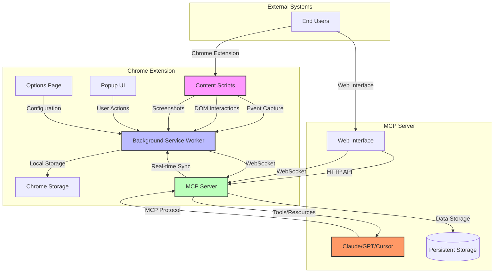
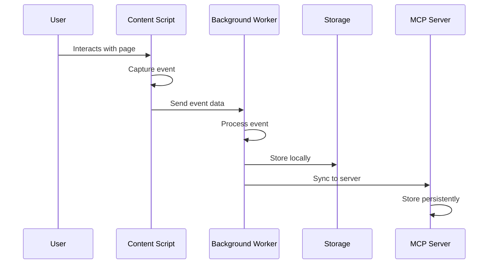
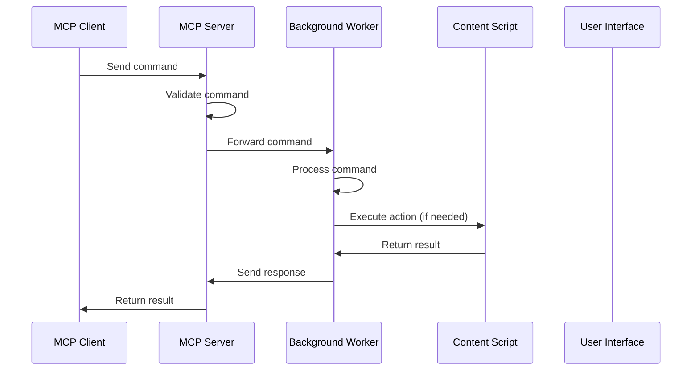
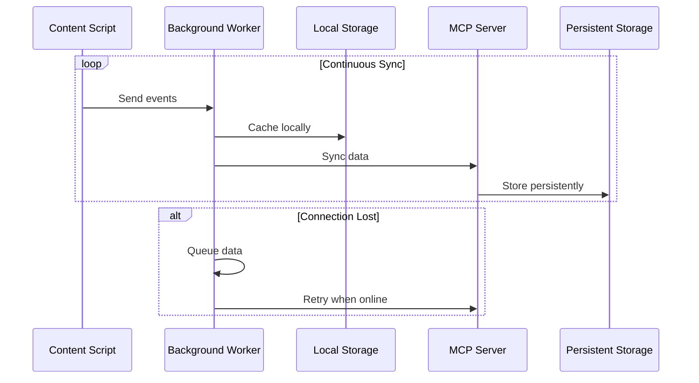
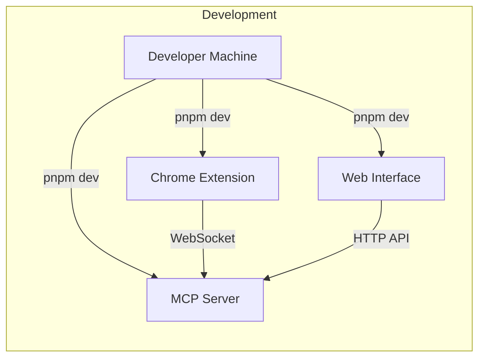
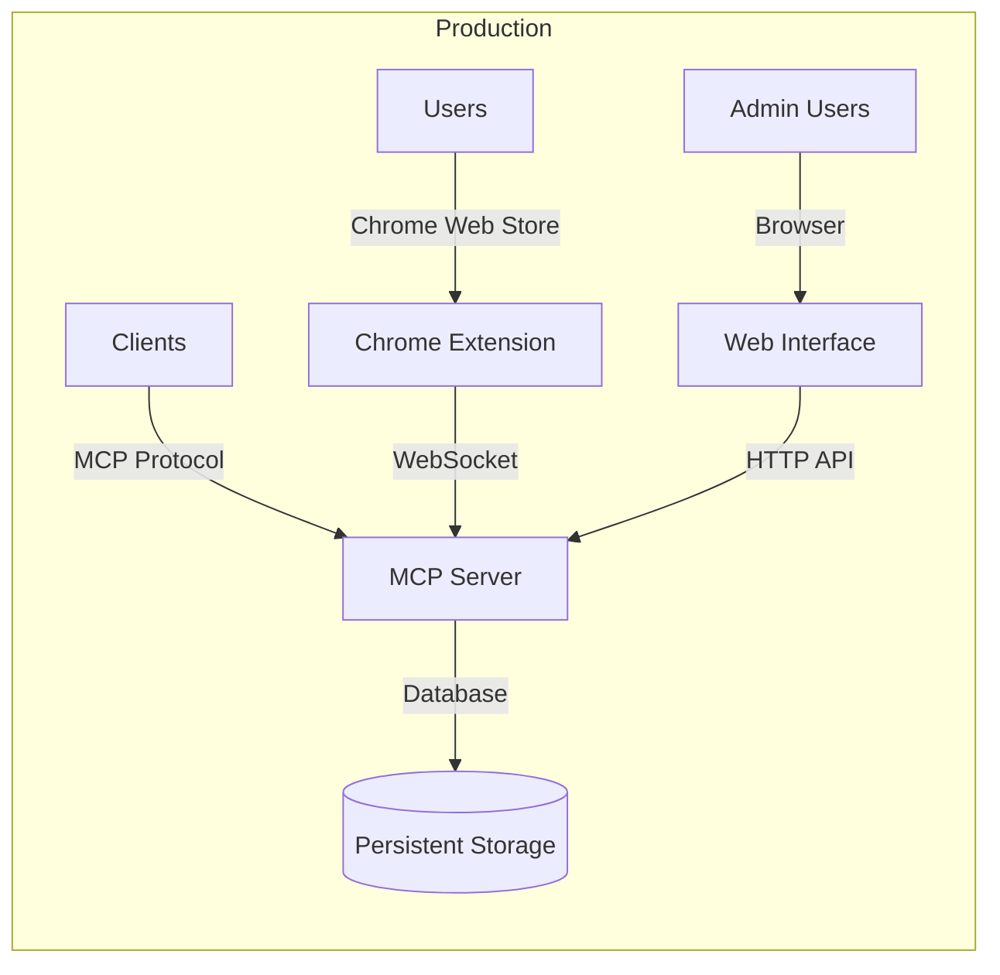

# System Architecture

## High-Level Architecture



## Technology Stack

### Chrome Extension (WXT)
- **Framework**: WXT with TypeScript 5.x
- **Manifest**: V3 with Service Worker
- **Storage**: Chrome Storage API (local)
- **Communication**: Message passing, WebSocket
- **Testing**: Vitest with WXT utilities

### MCP Server (XMCP)
- **Framework**: xmcp with TypeScript 5.x
- **Transport**: HTTP + WebSocket
- **Validation**: Zod schemas
- **Storage**: Persistent file-based or database
- **Testing**: Vitest

### Web Interface
- **Framework**: React with TypeScript
- **Build Tool**: Vite
- **Communication**: HTTP API + WebSocket
- **Testing**: Vitest + React Testing Library

### Shared Infrastructure
- **Package Manager**: pnpm with workspaces
- **Linting**: ESLint with TypeScript
- **Formatting**: Prettier
- **Monorepo**: Turborepo orchestration

## Component Architecture

### Chrome Extension Components

#### Background Service Worker
```typescript
// Core orchestration component
class BackgroundServiceWorker {
  sessionManager: SessionManager
  eventProcessor: EventProcessor
  networkMonitor: NetworkMonitor
  screenshotService: ScreenshotService
  mcpClient: MCPClient
  storageManager: StorageManager
}
```

**Responsibilities**:
- Session lifecycle management
- Event processing and storage
- Network request interception
- Screenshot coordination
- MCP server communication
- Local storage management

#### Content Scripts
```typescript
// DOM interaction and event capture
class ContentScriptManager {
  eventCapture: EventCapture
  domObserver: DOMObserver
  screenshotCapture: ScreenshotCapture
  messageHandler: MessageHandler
}
```

**Responsibilities**:
- DOM event capture (clicks, inputs)
- Navigation change detection
- Screenshot capture coordination
- Communication with background script

#### Popup UI
```typescript
// User interface for session control
class PopupController {
  sessionControls: SessionControls
  dataViewer: DataViewer
  exportControls: ExportControls
  statusIndicator: StatusIndicator
}
```

**Responsibilities**:
- Session start/stop controls
- Real-time data display
- Export functionality
- Connection status display

### MCP Server Components

#### Tool System
```typescript
// MCP tool definitions
class MCPTools {
  sessionTools: SessionTools
  dataTools: DataTools
  controlTools: ControlTools
  filterTools: FilterTools
}
```

**Tools**:
- `list_sessions`: List available sessions
- `get_session_data`: Retrieve session data
- `start_session`: Start new session
- `stop_session`: Stop active session
- `filter_events`: Filter events by criteria
- `execute_command`: Send commands to extension

#### Resource System
```typescript
// MCP resource definitions
class MCPResources {
  sessionResource: SessionResource
  dataResource: DataResource
  metricsResource: MetricsResource
}
```

**Resources**:
- `sessions://`: Session metadata access
- `data://`: Session data access
- `metrics://`: Performance metrics access

#### Prompt System
```typescript
// MCP prompt definitions
class MCPPrompts {
  analysisPrompts: AnalysisPrompts
  controlPrompts: ControlPrompts
  troubleshootingPrompts: TroubleshootingPrompts
}
```

**Prompts**:
- Session analysis guidance
- Data interpretation assistance
- Troubleshooting workflows

### Web Interface Components

#### Dashboard
```typescript
// Main management interface
class Dashboard {
  sessionManager: SessionManager
  dataViewer: DataViewer
  analyticsPanel: AnalyticsPanel
  realTimeUpdates: RealTimeUpdates
}
```

**Responsibilities**:
- Session overview and management
- Data visualization
- Real-time updates
- User preferences

## Data Flow Architecture

### Event Capture Flow


### Command Execution Flow


### Data Synchronization Flow


## Deployment Architecture

### Development Environment


### Production Environment


## Security Architecture

### Data Protection
- **Sensitive Data Filtering**: URL pattern matching for auth endpoints
- **Local Storage**: Session data cleared when new session starts
- **Server Storage**: Persistent data with public access model
- **Communication**: WebSocket with optional encryption

### Extension Security
- **Manifest V3**: Compliance with latest Chrome security requirements
- **Content Scripts**: Isolated execution environment
- **Permission Model**: Minimal required permissions
- **Data Validation**: Input validation at all entry points

### MCP Server Security
- **Tool Validation**: Zod schemas for all inputs
- **Resource Access**: Controlled access to session data
- **Command Execution**: Sandboxed command processing
- **Rate Limiting**: Optional rate limiting for API endpoints

## Performance Architecture

### Extension Performance
- **Event Debouncing**: Reduce rapid event processing
- **Batch Processing**: Group network requests
- **Memory Management**: Efficient data structures
- **Storage Optimization**: Compress large datasets

### Server Performance
- **Connection Pooling**: Efficient client connections
- **Query Optimization**: Fast data retrieval
- **Caching Strategy**: Cache frequently accessed data
- **Load Balancing**: Scale for multiple clients

## Monitoring and Observability

### Extension Monitoring
- **Performance Metrics**: Event capture timing, memory usage
- **Error Tracking**: Failed operations, connection issues
- **User Analytics**: Session duration, feature usage
- **Health Checks**: Extension status, connectivity

### Server Monitoring
- **API Metrics**: Request rates, response times
- **Database Performance**: Query performance, storage usage
- **Client Metrics**: Connected clients, data transfer
- **System Health**: CPU, memory, disk usage

## Scaling Considerations

### Horizontal Scaling
- **Stateless MCP Server**: Multiple server instances
- **Load Balancer**: Distribute client connections
- **Database Scaling**: Read replicas, sharding
- **CDN**: Static asset distribution

### Vertical Scaling
- **Resource Allocation**: CPU, memory for intensive operations
- **Storage Optimization**: Efficient data structures
- **Caching Layers**: Multiple cache levels
- **Connection Limits**: Optimize concurrent connections

This architecture provides a solid foundation for the Chrome Extension + MCP Server integration, balancing performance, security, and maintainability while meeting all constitutional requirements.