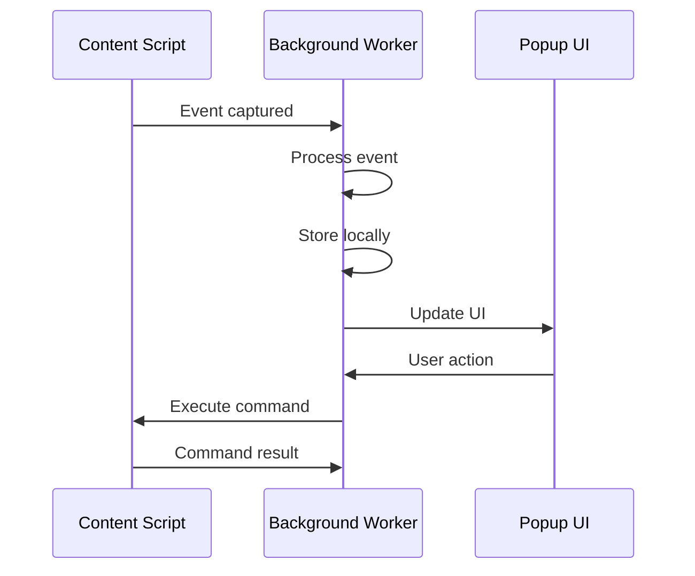
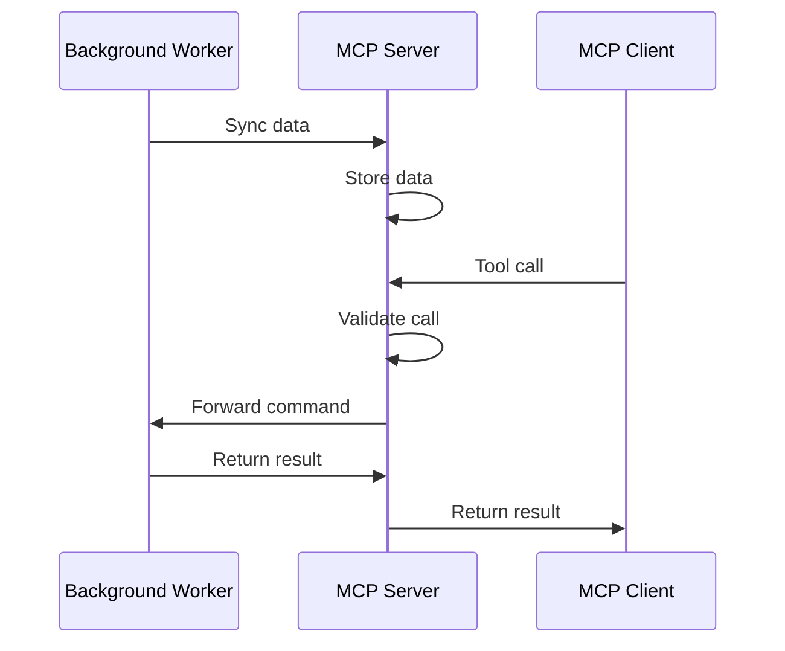
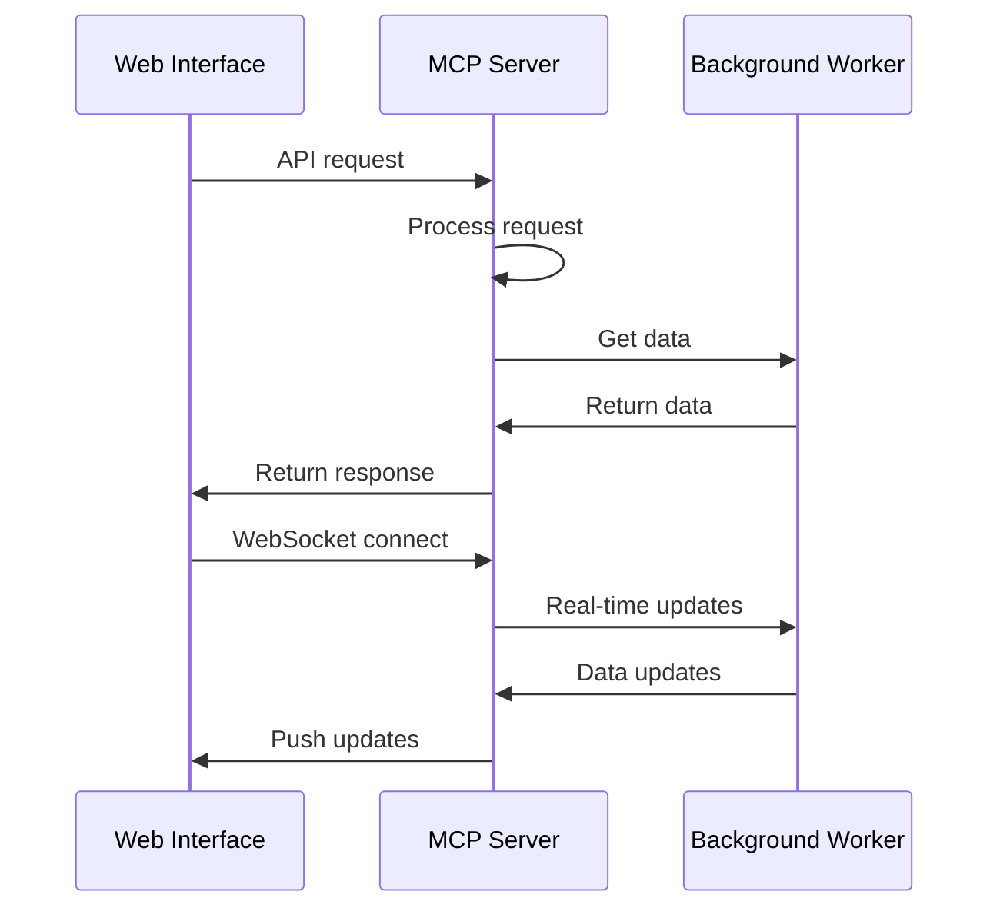

# Component Design

## Chrome Extension Components

### Background Service Worker

#### SessionManager
```typescript
class SessionManager {
  private activeSessions: Map<string, Session>
  private sessionHistory: Session[]

  async startSession(domain: string): Promise<Session>
  async stopSession(sessionId: string): Promise<void>
  async getSession(sessionId: string): Promise<Session>
  async listSessions(): Promise<Session[]>
  async clearSessionData(sessionId: string): Promise<void>
}
```

**Responsibilities**:
- Session lifecycle management
- Domain-specific session isolation
- Session metadata tracking
- Session history management

#### EventProcessor
```typescript
class EventProcessor {
  private eventQueue: Event[]
  private processingDebounce: number

  async processEvent(event: RawEvent): Promise<ProcessedEvent>
  async processBatch(events: RawEvent[]): Promise<ProcessedEvent[]>
  private validateEvent(event: RawEvent): boolean
  private enrichEvent(event: RawEvent): ProcessedEvent
}
```

**Responsibilities**:
- Event validation and enrichment
- Event debouncing and batching
- Event categorization
- Performance optimization

#### NetworkMonitor
```typescript
class NetworkMonitor {
  private requestFilters: RequestFilter[]
  private sensitivePatterns: RegExp[]

  async startMonitoring(): Promise<void>
  async stopMonitoring(): Promise<void>
  private handleRequest(request: RequestDetails): void
  private handleResponse(response: ResponseDetails): void
  private isSensitiveRequest(url: string): boolean
}
```

**Responsibilities**:
- Network request interception
- Sensitive data filtering
- Request/response logging
- Performance metrics tracking

#### MCPClient
```typescript
class MCPClient {
  private ws: WebSocket | null
  private reconnectAttempts: number
  private messageQueue: any[]

  async connect(serverUrl: string): Promise<void>
  async disconnect(): Promise<void>
  async sendToolCall(tool: string, params: any): Promise<any>
  async sendData(data: SessionData): Promise<void>
  private handleReconnect(): Promise<void>
}
```

**Responsibilities**:
- WebSocket connection management
- MCP protocol communication
- Data synchronization
- Connection recovery

### Content Scripts

#### EventCapture
```typescript
class EventCapture {
  private eventListeners: Map<string, EventListener>
  private captureConfig: CaptureConfig

  startCapture(): void
  stopCapture(): void
  private setupEventListeners(): void
  private captureClickEvent(event: MouseEvent): CapturedEvent
  private captureInputEvent(event: InputEvent): CapturedEvent
  private captureNavigationEvent(event: Event): CapturedEvent
}
```

**Responsibilities**:
- DOM event capture
- Event data extraction
- Event filtering
- Performance monitoring

#### ScreenshotCapture
```typescript
class ScreenshotCapture {
  private captureInterval: number
  private lastCaptureTime: number

  async captureScreenshot(): Promise<string>
  async captureOnDemand(): Promise<string>
  private shouldCapture(): boolean
  private compressScreenshot(base64: string): string
}
```

**Responsibilities**:
- Screenshot capture coordination
- Image compression
- Capture frequency management
- Performance optimization

#### MessageHandler
```typescript
class MessageHandler {
  private messagePort: chrome.runtime.Port

  setupMessagePort(): void
  sendMessage(message: ExtensionMessage): void
  private handleMessage(message: BackgroundMessage): void
  private sendEventToBackground(event: CapturedEvent): void
}
```

**Responsibilities**:
- Content script communication
- Message routing
- Data serialization
- Error handling

### Popup UI Components

#### SessionControls
```typescript
class SessionControls {
  private currentSession: Session | null
  private domainDetector: DomainDetector

  async startNewSession(): Promise<void>
  async stopCurrentSession(): Promise<void>
  async syncData(): Promise<void>
  updateUI(): void
  private getCurrentDomain(): string
}
```

**Responsibilities**:
- Session start/stop controls
- Domain detection
- Manual sync triggers
- UI state management

#### DataViewer
```typescript
class DataViewer {
  private currentSession: Session | null
  private filters: DataFilters

  displayEvents(): void
  displayNetworkLogs(): void
  displayConsoleLogs(): void
  applyFilters(filters: DataFilters): void
  exportData(): void
}
```

**Responsibilities**:
- Real-time data display
- Data filtering and search
- Export functionality
- Performance optimization

## MCP Server Components

#### SessionTools
```typescript
class SessionTools {
  private sessionService: SessionService

  @Tool({
    name: 'list_sessions',
    description: 'List all available sessions'
  })
  async listSessions(): Promise<Session[]>

  @Tool({
    name: 'get_session',
    description: 'Get session data by ID'
  })
  async getSession(sessionId: string): Promise<Session>

  @Tool({
    name: 'start_session',
    description: 'Start a new session'
  })
  async startSession(domain: string): Promise<Session>

  @Tool({
    name: 'stop_session',
    description: 'Stop an active session'
  })
  async stopSession(sessionId: string): Promise<void>
}
```

**Responsibilities**:
- Session management tools
- Tool schema validation
- Error handling
- Response formatting

#### DataTools
```typescript
class DataTools {
  private dataService: DataService

  @Tool({
    name: 'get_events',
    description: 'Get events from a session'
  })
  async getEvents(sessionId: string, filters?: EventFilters): Promise<Event[]>

  @Tool({
    name: 'get_network_logs',
    description: 'Get network logs from a session'
  })
  async getNetworkLogs(sessionId: string, filters?: NetworkFilters): Promise<NetworkLog[]>

  @Tool({
    name: 'get_console_logs',
    description: 'Get console logs from a session'
  })
  async getConsoleLogs(sessionId: string, filters?: ConsoleFilters): Promise<ConsoleLog[]>

  @Tool({
    name: 'get_screenshots',
    description: 'Get screenshots from a session'
  })
  async getScreenshots(sessionId: string): Promise<Screenshot[]>
}
```

**Responsibilities**:
- Data retrieval tools
- Filtering and pagination
- Data transformation
- Performance optimization

#### ControlTools
```typescript
class ControlTools {
  private extensionService: ExtensionService

  @Tool({
    name: 'execute_command',
    description: 'Execute command on extension'
  })
  async executeCommand(sessionId: string, command: string, params?: any): Promise<any>

  @Tool({
    name: 'capture_screenshot',
    description: 'Capture screenshot on demand'
  })
  async captureScreenshot(sessionId: string): Promise<string>

  @Tool({
    name: 'set_capture_config',
    description: 'Configure capture settings'
  })
  async setCaptureConfig(sessionId: string, config: CaptureConfig): Promise<void>
}
```

**Responsibilities**:
- Extension control tools
- Command execution
- Configuration management
- Security validation

#### SessionService
```typescript
class SessionService {
  private sessionStore: SessionStore
  private eventStore: EventStore

  async createSession(domain: string): Promise<Session>
  async updateSession(sessionId: string, updates: Partial<Session>): Promise<void>
  async getSession(sessionId: string): Promise<Session>
  async listSessions(): Promise<Session[]>
  async deleteSession(sessionId: string): Promise<void>
}
```

**Responsibilities**:
- Session data management
- Session lifecycle
- Metadata tracking
- Data persistence

#### DataService
```typescript
class DataService {
  private eventStore: EventStore
  private networkStore: NetworkStore
  private consoleStore: ConsoleStore
  private screenshotStore: ScreenshotStore

  async getEvents(sessionId: string, filters?: EventFilters): Promise<Event[]>
  async getNetworkLogs(sessionId: string, filters?: NetworkFilters): Promise<NetworkLog[]>
  async getConsoleLogs(sessionId: string, filters?: ConsoleFilters): Promise<ConsoleLog[]>
  async getScreenshots(sessionId: string): Promise<Screenshot[]>
  async storeData(sessionId: string, data: SessionData): Promise<void>
}
```

**Responsibilities**:
- Data retrieval and storage
- Data filtering and search
- Data transformation
- Performance optimization

#### ExtensionService
```typescript
class ExtensionService {
  private connectionManager: ConnectionManager
  private commandValidator: CommandValidator

  async sendCommand(sessionId: string, command: string, params?: any): Promise<any>
  async isConnected(sessionId: string): Promise<boolean>
  private validateCommand(command: string, params?: any): boolean
  private sendToExtension(message: ExtensionCommand): Promise<any>
}
```

**Responsibilities**:
- Extension communication
- Command validation
- Connection management
- Error handling

## Web Interface Components

#### SessionManager
```typescript
class SessionManager {
  private apiClient: APIClient
  private sessions: Session[]

  async loadSessions(): Promise<void>
  async createSession(domain: string): Promise<Session>
  async deleteSession(sessionId: string): Promise<void>
  async startSession(sessionId: string): Promise<void>
  async stopSession(sessionId: string): Promise<void>
}
```

**Responsibilities**:
- Session management UI
- API communication
- Session state management
- User interactions

#### DataViewer
```typescript
class DataViewer {
  private apiClient: APIClient
  private currentSession: Session | null
  private filters: DataFilters

  async loadData(sessionId: string): Promise<void>
  applyFilters(filters: DataFilters): void
  exportData(format: 'json' | 'csv'): void
  private renderEvents(): void
  private renderNetworkLogs(): void
  private renderConsoleLogs(): void
}
```

**Responsibilities**:
- Data visualization
- Interactive filtering
- Export functionality
- Real-time updates

#### RealTimeUpdates
```typescript
class RealTimeUpdates {
  private websocket: WebSocket
  private eventHandlers: Map<string, Function>

  connect(): void
  disconnect(): void
  on(event: string, handler: Function): void
  off(event: string, handler: Function): void
  private handleMessage(message: WebSocketMessage): void
}
```

**Responsibilities**:
- WebSocket connection management
- Real-time data updates
- Event handling
- Connection recovery

## Component Interaction Patterns

### Extension Internal Communication


### MCP Server Communication


### Web Interface Communication


## Error Handling Patterns

### Extension Error Handling
```typescript
class ErrorHandler {
  static handleExtensionError(error: Error, context: string): void {
    console.error(`[${context}] ${error.message}`)
    // Send error to MCP server for tracking
    // Show user-friendly message in UI
  }

  static handleNetworkError(error: Error): void {
    // Retry logic for network failures
    // Queue data for later sync
    // Update UI connection status
  }

  static handleStorageError(error: Error): void {
    // Clear local storage if quota exceeded
    // Compress existing data
    // Notify user of storage issues
  }
}
```

### MCP Server Error Handling
```typescript
class MCPErrorHandler {
  static handleToolError(error: Error, tool: string): MCPResponse {
    return {
      success: false,
      error: {
        code: 'TOOL_ERROR',
        message: error.message,
        tool
      }
    }
  }

  static handleValidationError(error: z.ZodError): MCPResponse {
    return {
      success: false,
      error: {
        code: 'VALIDATION_ERROR',
        message: 'Invalid input parameters',
        details: error.errors
      }
    }
  }

  static handleConnectionError(error: Error): void {
    // Log connection errors
    // Attempt reconnection
    // Notify connected clients
  }
}
```

This component design provides a comprehensive breakdown of all major components in the system, with clear responsibilities, interfaces, and interaction patterns. Each component is designed to be testable, maintainable, and aligned with the constitutional requirements.