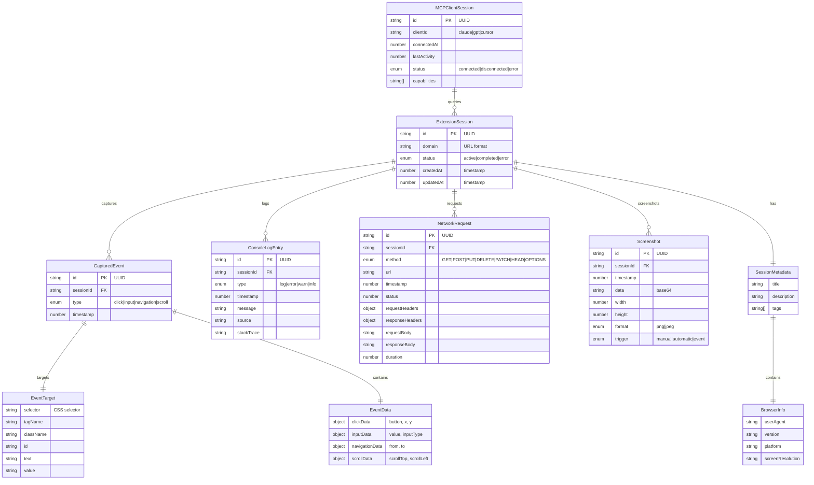

# Data Model: Chrome Extension + MCP Server Integration

## Entity Relationship Diagram (ERD)



## Core Entities

### ExtensionSession
Represents a single tracking session for a specific domain.

**Fields**:
- `id`: string (UUID) - Unique session identifier
- `domain`: string - Domain being tracked
- `status`: 'active' | 'completed' | 'error' - Current session state
- `createdAt`: number (timestamp) - Session creation time
- `updatedAt`: number (timestamp) - Last update time
- `metadata`: SessionMetadata - Additional session information

**Validation Rules**:
- `id` must be valid UUID
- `domain` must be valid URL format
- `status` transitions: active → completed or active → error

### SessionMetadata
Additional session information.

**Fields**:
- `title`: string - User-defined session title
- `description`: string - Session description
- `tags`: string[] - User-defined tags
- `browserInfo`: BrowserInfo - Browser and environment information

### BrowserInfo
Browser and environment details.

**Fields**:
- `userAgent`: string - Browser user agent
- `version`: string - Browser version
- `platform`: string - Operating system
- `screenResolution`: string - Screen dimensions

### CapturedEvent
User interactions captured during session.

**Fields**:
- `id`: string (UUID) - Unique event identifier
- `sessionId`: string - Reference to parent session
- `type`: 'click' | 'input' | 'navigation' | 'scroll' - Event type
- `timestamp`: number - Event timestamp
- `target`: EventTarget - Element that triggered the event
- `data`: EventData - Event-specific data

**Validation Rules**:
- `sessionId` must reference valid ExtensionSession
- `type` must be one of allowed values
- `target` must contain valid selector and element info

### EventTarget
Information about the element that triggered the event.

**Fields**:
- `selector`: string - CSS selector for the element
- `tagName`: string - HTML tag name
- `className`: string - Element class name
- `id`: string - Element ID (if present)
- `text`: string - Element text content (truncated)
- `value`: string - Element value (for inputs)

### EventData
Type-specific event data.

**Fields**:
- For 'click': `{ button: number, x: number, y: number }`
- For 'input': `{ value: string, inputType: string }`
- For 'navigation': `{ from: string, to: string }`
- For 'scroll': `{ scrollTop: number, scrollLeft: number }`

### ConsoleLogEntry
System-generated console messages.

**Fields**:
- `id`: string (UUID) - Unique log identifier
- `sessionId`: string - Reference to parent session
- `type`: 'log' | 'error' | 'warn' | 'info' - Log level
- `timestamp`: number - Log timestamp
- `message`: string - Log message content
- `source`: string - Source file and line number
- `stackTrace`: string - Stack trace (for errors)

**Validation Rules**:
- `sessionId` must reference valid ExtensionSession
- `type` must be one of allowed values
- `message` length limited to prevent storage issues

### NetworkRequest
HTTP/HTTPS communications captured during session.

**Fields**:
- `id`: string (UUID) - Unique request identifier
- `sessionId`: string - Reference to parent session
- `method`: 'GET' | 'POST' | 'PUT' | 'DELETE' | 'PATCH' | 'HEAD' | 'OPTIONS' - HTTP method
- `url`: string - Request URL
- `timestamp`: number - Request timestamp
- `status`: number - HTTP status code
- `requestHeaders`: Record<string, string> - Request headers
- `responseHeaders`: Record<string, string> - Response headers
- `requestBody`: string - Request body (if present)
- `responseBody`: string - Response body (if present)
- `duration`: number - Request duration in milliseconds

**Validation Rules**:
- `sessionId` must reference valid ExtensionSession
- `url` must be valid URL format
- Sensitive URLs (auth, passwords) must be filtered out
- Body content limited to prevent storage issues

### Screenshot
Visual capture of page state.

**Fields**:
- `id`: string (UUID) - Unique screenshot identifier
- `sessionId`: string - Reference to parent session
- `timestamp`: number - Screenshot timestamp
- `data`: string - Base64 encoded image data
- `width`: number - Image width
- `height`: number - Image height
- `format`: 'png' | 'jpeg' - Image format
- `trigger`: 'manual' | 'automatic' | 'event' - What triggered the screenshot

**Validation Rules**:
- `sessionId` must reference valid ExtensionSession
- `data` must be valid base64 string
- Image dimensions must be reasonable
- File size limited to prevent storage issues

### MCPClientSession
Represents a connection session from an MCP client.

**Fields**:
- `id`: string (UUID) - Unique client session identifier
- `clientId`: string - MCP client identifier (e.g., 'claude', 'gpt', 'cursor')
- `connectedAt`: number - Connection timestamp
- `lastActivity`: number - Last activity timestamp
- `status`: 'connected' | 'disconnected' | 'error' - Connection status
- `capabilities`: string[] - Client capabilities

**Validation Rules**:
- `id` must be valid UUID
- `clientId` must be non-empty
- `status` transitions: connected → disconnected or connected → error

## Relationships

```
ExtensionSession (1) → (N) CapturedEvent
ExtensionSession (1) → (N) ConsoleLogEntry
ExtensionSession (1) → (N) NetworkRequest
ExtensionSession (1) → (N) Screenshot
MCPClientSession (1) → (N) ExtensionSession (via queries)
```

## State Transitions

### ExtensionSession
1. **Created**: Session initialized but not started
2. **Active**: Session is capturing data
3. **Completed**: Session stopped normally
4. **Error**: Session stopped due to error

### MCPClientSession
1. **Connected**: Client established connection
2. **Active**: Client is actively using the system
3. **Disconnected**: Client disconnected normally
4. **Error**: Client disconnected due to error

## Data Access Patterns

### Session Data Querying
- By session ID: Retrieve complete session data
- By domain: List sessions for specific domain
- By time range: Filter sessions by creation time
- By status: Filter sessions by current state

### Event Filtering
- By type: Filter events by click/input/navigation/scroll
- By time range: Filter events within time window
- By element: Filter events by target element selector

### Network Request Filtering
- By method: Filter by HTTP method
- By status code: Filter by HTTP status
- By URL pattern: Filter by URL regex pattern
- By time range: Filter within time window

### Log Filtering
- By level: Filter by log/error/warn/info
- By source: Filter by source file
- By content: Filter by message content

## Storage Considerations

### Browser Storage (ExtensionSession, current session data)
- Cleared when new session starts on same domain
- Limited by browser storage quotas
- Optimized for real-time access

### Server Storage (All data, historical access)
- Persistent storage with indefinite retention
- Indexed for efficient querying
- Scalable for multiple sessions

### Data Compression
- Base64 images stored as-is
- Text data compressed for network transfer
- Duplicate detection and deduplication where possible