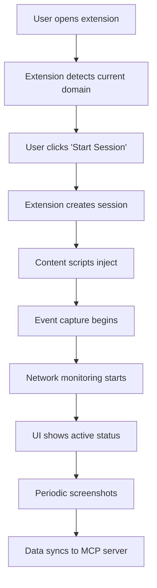
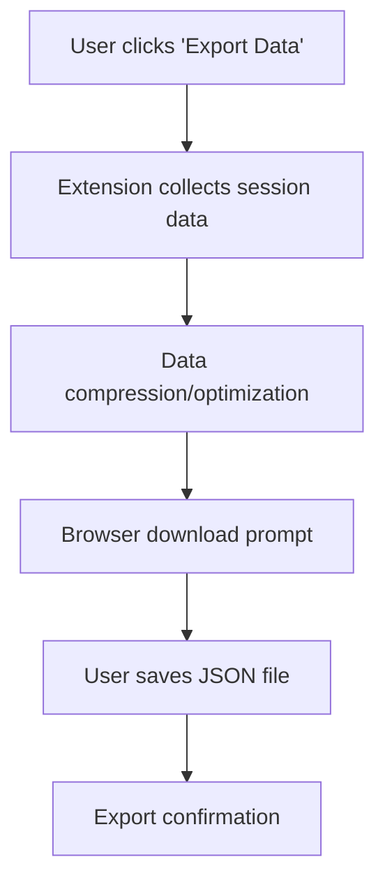
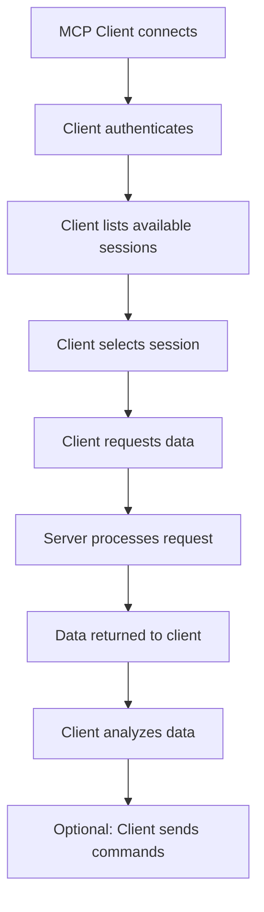

# UI/UX Mockup Design

## Chrome Extension Popup Interface

### Main Popup View
```
┌─────────────────────────────────────────────────────────────┐
│  🔍 Chrome Activity Tracker                    ⚙️ ❌        │
├─────────────────────────────────────────────────────────────┤
│                                                             │
│  Current Domain: example.com                               │
│  Status: ● Active Recording                                 │
│  Session: session_123 (started 2 min ago)                   │
│                                                             │
│  ┌─────────────────────────────────────────────────────────┐ │
│  │ 📊 Session Statistics                                  │ │
│  │ • Events captured: 1,247                               │ │
│  │ • Network requests: 89                                │ │
│  │ • Console logs: 12                                    │ │
│  │ • Screenshots: 3                                      │ │
│  └─────────────────────────────────────────────────────────┘ │
│                                                             │
│  ┌─────────────────────────────────────────────────────────┐ │
│  │ 🎮 Session Controls                                   │ │
│  │                                                         │ │
│  │ [🛑 Stop Session]         [📥 Export Data]           │ │
│  │                                                         │ │
│  │ [🔄 Sync Now]              [📷 Capture Screenshot]     │ │
│  └─────────────────────────────────────────────────────────┘ │
│                                                             │
│  ┌─────────────────────────────────────────────────────────┐ │
│  │ 🔌 Connection Status                                  │ │
│  │ MCP Server: 🟢 Connected                                │ │
│  │ Last Sync: 30 seconds ago                              │ │
│  └─────────────────────────────────────────────────────────┘ │
└─────────────────────────────────────────────────────────────┘
```

### Data Viewer View
```
┌─────────────────────────────────────────────────────────────┐
│  📊 Session Data Viewer                    ← Back        │
├─────────────────────────────────────────────────────────────┤
│                                                             │
│  🔍 Search: [           ] 🎚️ Filters ▼                       │
│                                                             │
│  ┌─────────────────────────────────────────────────────────┐ │
│  │ 📑 Events (1,247)                                   [▶️] │ │
│  │ 🌐 Network (89)                                     [▶️] │ │
│  │ 💻 Console (12)                                     [▶️] │ │
│  │ 📷 Screenshots (3)                                  [▶️] │ │
│  └─────────────────────────────────────────────────────────┘ │
│                                                             │
│  ┌─────────────────────────────────────────────────────────┐ │
│  │ 📋 Events List                                        │ │
│  │                                                         │ │
│  │ 14:32:15 🖱️ Click on #submit-button                    │ │
│  │ 14:32:12 ⌨️  Input in #email-field                     │ │
│  │ 14:32:10 🖱️ Click on #login-link                      │ │
│  │ 14:32:05 🔄 Navigation to /login                      │ │
│  │                                                         │ │
│  │ [Previous] [1/50] [Next]                                 │ │
│  └─────────────────────────────────────────────────────────┘ │
│                                                             │
│  [📥 Export JSON] [📊 View Analytics]                       │
└─────────────────────────────────────────────────────────────┘
```

### Settings View
```
┌─────────────────────────────────────────────────────────────┐
│  ⚙️ Settings                                 ← Back        │
├─────────────────────────────────────────────────────────────┤
│                                                             │
│  🌐 MCP Server Configuration                               │
│  Server URL: [ws://localhost:3001        ]                 │
│  [🔄 Test Connection]                                         │
│                                                             │
│  📷 Screenshot Settings                                    │
│  Capture Interval: [30 seconds ▼]                          │
│  Quality: [High ▼]                                          │
│  Max per Session: [50 ▼]                                   │
│                                                             │
│  🔒 Privacy Settings                                       │
│  [✓] Exclude sensitive URLs                                 │
│  [✓] Exclude password fields                               │
│  [✓] Exclude authentication tokens                          │
│                                                             │
│  💾 Data Management                                         │
│  [🗑️ Clear All Local Data]                                 │
│  [📊 View Storage Usage]                                   │
│                                                             │
│  [💾 Save Settings]                                        │
└─────────────────────────────────────────────────────────────┘
```

## Web Interface

### Dashboard View
```
┌─────────────────────────────────────────────────────────────────────────┐
│  🏠 Chrome Activity Dashboard                     🔄 📊 🛠️ 👤          │
├─────────────────────────────────────────────────────────────────────────┤
│                                                                         │
│  ┌─────────────────┐ ┌─────────────────────────────────────────────────┐ │
│  │ 📊 Quick Stats  │ │ 📈 Active Sessions                              │ │
│  │                 │ │                                                 │ │
│  │ Sessions: 24    │ │ ┌─────────────────────────────────────────────┐ │ │
│  │ Events: 45.2K   │ │ │ example.com                               │ │
│  │ Network: 3.1K   │ │ │ Status: 🟢 Active | 15 min | 1,247 events │ │ │
│  │ Storage: 2.3GB  │ │ │ ┌─────────────────────────────────────────┐ │ │ │
│  │                 │ │ │ [View] [Stop] [Export]                 │ │ │ │
│  └─────────────────┘ │ └─────────────────────────────────────────┘ │ │ │
│                      │                                                 │ │
│                      │ ┌─────────────────────────────────────────────┐ │ │
│                      │ │ github.com                                  │ │
│                      │ │ Status: 🟡 Idle | 2 hr ago | 89 events     │ │ │
│                      │ │ ┌─────────────────────────────────────────┐ │ │ │
│                      │ │ │ [View] [Start] [Export]                │ │ │ │
│                      │ └─────────────────────────────────────────┘ │ │ │
│                      │                                                 │ │
│                      │ ┌─────────────────────────────────────────────┐ │ │
│                      │ │ stackoverflow.com                           │ │
│                      │ │ Status: ⚫ Stopped | 1 day ago | 2.1K events│ │ │
│                      │ │ ┌─────────────────────────────────────────┐ │ │ │
│                      │ │ │ [View] [Start] [Delete]                 │ │ │ │
│                      │ └─────────────────────────────────────────┘ │ │ │
│                      └─────────────────────────────────────────────────┘ │
│                                                                         │
│  ┌─────────────────────────────────────────────────────────────────────┐ │
│  │ 📅 Recent Activity                                                  │ │
│  │                                                                     │ │
│  │ 14:32:15 example.com - New session started                         │ │
│  │ 14:28:42 github.com - Session stopped                              │ │
│  │ 14:15:30 stackoverflow.com - Data exported (1.2MB)                 │ │
│  │ 14:10:12 MCP Client connected - Session data retrieved             │ │
│  └─────────────────────────────────────────────────────────────────────┘ │
└─────────────────────────────────────────────────────────────────────────┘
```

### Session Detail View
```
┌─────────────────────────────────────────────────────────────────────────┐
│  📊 Session: example.com                       ← Back 📥 🗑️         │
├─────────────────────────────────────────────────────────────────────────┤
│                                                                         │
│  📋 Session Information                                               │
│  Domain: example.com                                                    │
│  Started: 2025-09-30 14:32:15 (2 min ago)                              │
│  Status: 🟢 Active                                                    │
│  Size: 1.2 MB                                                          │
│                                                                         │
│  ┌─────────────────────────────────────────────────────────────────────┐ │
│  │ 🎛️ Data Explorer                                                   │ │
│  │                                                                     │ │
│  │ ┌─────────────┐ ┌─────────────────────────────────────────────────┐ │ │
│  │ │ 📑 Events   │ │ 📊 Event Distribution                         │ │ │
│  │ │ (1,247)     │ │                                                 │ │ │
│  │ │ 🖱️ Clicks   │ │ ┌─────────────────────────────────────────┐   │ │ │
│  │ │ (856)       │ │ │ Clicks ████████████████████████ 68%     │   │ │ │
│  │ │ ⌨️ Inputs    │ │ │ Inputs ████████████ 32%                │   │ │ │
│  │ │ (391)       │ │ │                                       │   │ │ │
│  │ │ 🔄 Nav       │ │ └─────────────────────────────────────────┘   │ │ │
│  │ │ (45)        │ │                                               │ │ │
│  │ └─────────────┘ │ ┌─────────────────────────────────────────┐   │ │ │
│  │                 │ │ 📷 Recent Screenshots                    │   │ │ │
│  │                 │ │ ┌─────────┐ ┌─────────┐ ┌─────────┐     │   │ │ │
│  │                 │ │ │ Thumbnail│ │ Thumbnail│ │ Thumbnail│     │   │ │ │
│  │                 │ │ │ 14:32:15 │ │ 14:31:45 │ │ 14:31:15 │     │   │ │ │
│  │                 │ │ └─────────┘ └─────────┘ └─────────┘     │   │ │ │
│  │                 │ └─────────────────────────────────────────┘   │ │ │
│  └─────────────────────────────────────────────────────────────────────┘ │
│                                                                         │
│  🎛️ Filters: [🕐 Time] [📂 Type] [🔍 Search] [🎯 Advanced]          │
│                                                                         │
│  ┌─────────────────────────────────────────────────────────────────────┐ │
│  │ 📋 Event Timeline                                                  │ │
│  │                                                                     │ │
│  │ 14:32:15 🖱️ Click on #submit-button                               │ │
│  │    Target: <button id="submit-button">Submit Form</button>         │ │
│  │    Position: {x: 450, y: 320}                                     │ │
│  │                                                                     │ │
│  │ 14:32:12 ⌨️  Input in #email-field                                │ │
│  │    Field: <input type="email" id="email-field">                   │ │
│  │    Value: "user@example.com" (partial)                            │ │
│  │                                                                     │ │
│  │ 14:32:10 🖱️ Click on #login-link                                  │ │
│  │    Target: <a href="/login" id="login-link">Login</a>               │ │
│  │                                                                     │ │
│  └─────────────────────────────────────────────────────────────────────┘ │
│                                                                         │
│  [Previous] [1/50] [Next]    [📥 Export JSON] [📊 Analytics] [🔄 Live] │
└─────────────────────────────────────────────────────────────────────────┘
```

### Network Logs View
```
┌─────────────────────────────────────────────────────────────────────────┐
│  🌐 Network Logs - example.com             ← Back 📥 🔍           │
├─────────────────────────────────────────────────────────────────────────┤
│                                                                         │
│  🔍 Filter: [           ] [🕐 Date ▼] [📊 Status ▼] [🔒 Security ▼]   │
│                                                                         │
│  ┌─────────────────────────────────────────────────────────────────────┐ │
│  │ 📋 Network Requests (89)                                           │ │
│  │                                                                     │ │
│  │ 14:32:15 🟢 POST /api/login                                        │ │
│  │    Duration: 245ms                                                 │ │
│  │    Status: 200 OK                                                  │ │
│  │    Size: 1.2 KB                                                   │ │
│  │    [📋 Details] [🔍 Inspect]                                       │ │
│  │                                                                     │ │
│  │ 14:32:10 🟢 GET /api/user                                          │ │
│  │    Duration: 89ms                                                  │ │
│  │    Status: 200 OK                                                  │ │
│  │    Size: 856 B                                                     │ │
│  │    [📋 Details] [🔍 Inspect]                                       │ │
│  │                                                                     │ │
│  │ 14:32:05 🟡 GET /api/sessions                                       │ │
│  │    Duration: 1.2s                                                  │ │
│  │    Status: 404 Not Found                                           │ │
│  │    Size: 156 B                                                     │ │
│  │    [📋 Details] [🔍 Inspect]                                       │ │
│  │                                                                     │ │
│  └─────────────────────────────────────────────────────────────────────┘ │
│                                                                         │
│  [📊 Performance] [🔒 Security] [📥 Export HAR]                        │
└─────────────────────────────────────────────────────────────────────────┘
```

### Console Logs View
```
┌─────────────────────────────────────────────────────────────────────────┐
│  💻 Console Logs - example.com             ← Back 📥 🔍           │
├─────────────────────────────────────────────────────────────────────────┤
│                                                                         │
│  🔍 Filter: [           ] [📊 Level ▼] [📂 Source ▼] [🕐 Time ▼]      │
│                                                                         │
│  ┌─────────────────────────────────────────────────────────────────────┐ │
│  │ 📋 Console Messages (12)                                           │ │
│  │                                                                     │ │
│  │ 14:32:15 🔵 LOG app.js:245                                         │ │
│  │    Form submitted successfully                                      │ │
│  │    [📋 Copy] [🔍 Trace]                                            │ │
│  │                                                                     │ │
│  │ 14:32:12 🟡 WARN utils.js:89                                       │ │
│  │    Deprecated method used                                          │ │
│  │    [📋 Copy] [🔍 Trace]                                            │ │
│  │                                                                     │ │
│  │ 14:32:10 🔴 ERROR api.js:156                                       │ │
│  │    Failed to fetch user data: Network error                        │ │
│  │    [📋 Copy] [🔍 Trace]                                            │ │
│  │                                                                     │ │
│  │ 14:32:05 🔵 INFO auth.js:234                                       │ │
│  │    User authentication successful                                   │ │
│  │    [📋 Copy] [🔍 Trace]                                            │ │
│  │                                                                     │ │
│  └─────────────────────────────────────────────────────────────────────┘ │
│                                                                         │
│  [📊 Statistics] [🔍 Search] [📥 Export]                            │
└─────────────────────────────────────────────────────────────────────────┘
```

## User Flow Diagrams

### Session Start Flow


### Data Export Flow


### MCP Client Interaction Flow


## Design Guidelines

### Color Scheme
- **Primary**: Blue (#3B82F6) for active states
- **Success**: Green (#10B981) for positive status
- **Warning**: Yellow (#F59E0B) for attention needed
- **Error**: Red (#EF4444) for errors
- **Neutral**: Gray (#6B7280) for inactive states

### Typography
- **Headings**: Inter, bold, 16-20px
- **Body**: Inter, regular, 14px
- **Code**: JetBrains Mono, 12px
- **Buttons**: Inter, medium, 14px

### Iconography
- **Status**: Circles with colors (🟢 🟡 🔴 ⚫)
- **Actions**: Clear, descriptive icons (🛑 📥 🔄 📷)
- **Navigation**: Simple arrow-based navigation
- **Data**: Category-specific icons (📑 🌐 💻 📷)

### Responsive Design
- **Extension Popup**: Fixed width (400px), scrollable content
- **Web Interface**: Fluid layout, mobile-responsive
- **Data Tables**: Horizontal scrolling on mobile
- **Forms**: Stack vertically on mobile

### Accessibility
- **Keyboard Navigation**: Full keyboard support
- **Screen Reader**: Proper ARIA labels
- **Color Contrast**: WCAG AA compliance
- **Focus States**: Visible focus indicators

This UI/UX design provides a comprehensive user interface for both the Chrome extension and web interface, with clear user flows, consistent design patterns, and accessibility considerations.